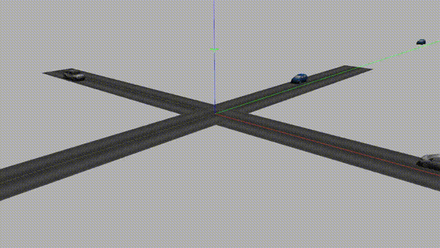

# Submission for the AImotive Planning and Decision Making assignment

A brief overview of the approach employed to solve the problem of traversing a road intersection by an autonomous vehicle while minimizing a performance criteria and respecting kinodynamic constraints as well as obeying the traffic laws. This problem tackles several issues including collision prediction, planning, and control of the vehicle. 

The proposed implementation is based on a Model Predictive Controller (MPC) for controlling the ego vehicle in a simulated intersection scenario. The collision prediction algorithm is based on the concept of collision cone and velocity obstacle. This approach seems to show great potential in providing efficient navigation and easily extends to robust and nonlinear problems.

## Collision prediction
I had the opportunity to collaborate with prof. Zvi Shiller who co-authored the seminal work on velocity obstacles and collision avoidance in a dynamic environment \cite{Fiorini1998}. In the current implementation, I rely on the concept of Collision Cone (CC) \cite{Chakravarthy1998} and Velocity Obstacle(VO) for collision prediction. The collision prediction is based on the Line Of Sight (LOS) kinematics and in particular the following condition ( Eq(16) in \cite{Chakravarthy1998})   

 Due to space limitation, please refer to \cite{Chakravarthy1998} for more details. 

## Model Predictive Controller
MPC is a feedback scheme in which an optimal control problem, looking ahead in time for a finite horizon, is solved at each time step. The first part of the optimal sequence is applied and the optimization is repeated at regular intervals. Since optimization techniques naturally handle hard constraints, MPC can be explicitly aware of the constraints, such as speed or control limits and obstacle avoidance, and operate close to, but within, their boundaries. 

Implements a Model Predictive Controller (MPC) for a kinematic point mass model of a vehicle, while taking into consideration the limits on velocity , acceleration and jerk. The current implementation of the MPC controller relies on the IPOPT solver (Interior Point OPTimizer) and the CppAD (C++ Algorithmic Differentiation) package
for solving the optimization problem and calculating the gradients, respectively. 
## Third-order point mass model of the ego-vehicle

x[t+1]=x[t] + v[t]*dt +1/2* a[t] *dt² +1/6* J *dt³

v[t+1]=v[t] + a[t]*dt +1/2*J*dt²

a[t+1]=a[t] + J[t]*dt

#

### TODO list 
- [ ] Update the description with more details.
- [ ] Include a 1 page PDF describing the solution.

